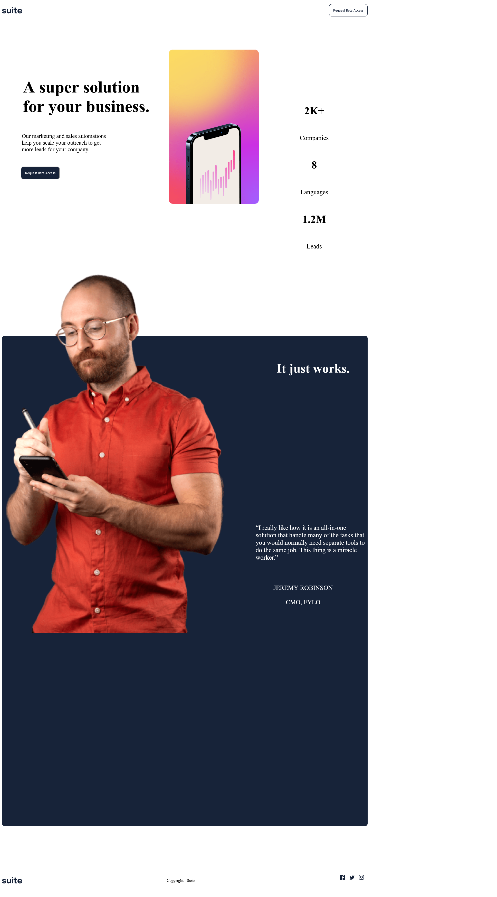

# Frontend Mentor - Suite landing page solution

This is a solution to the [Suite landing page challenge on Frontend Mentor](https://www.frontendmentor.io/challenges/suite-landing-page-tj_eaU-Ra). Frontend Mentor challenges help you improve your coding skills by building realistic projects.

## Table of contents

- [Overview](#overview)
  - [The challenge](#the-challenge)
  - [Screenshot](#screenshot)
  - [Links](#links)
  - [Built with](#built-with)
  - [Author](#author)

## Overview

### The challenge

Users should be able to:

- View the optimal layout depending on their device's screen size
- See hover states for interactive elements

### Screenshot

### Links

- Solution URL: [GitHub Code Repository](https://github.com/DarkPhoenixNinja92/suite-landing-page)
- Live Site URL: [GitHub Pages Live Site](darkphoenixninja92.github.io/suite-landing-page)s

## My process

### Built with

- Semantic HTML5 markup
- CSS custom properties
- Flexbox
- Mobile-first workflow

## Author

- Website - [Shaun Pour](https://www.scpour.com)
- Frontend Mentor - [@DarkPhoenixNinja92](https://www.frontendmentor.io/profile/DarkPhoenixNinja92)
- Twitter - [@Dark_Ninja92](https://www.twitter.com/Dark_Ninja92)
